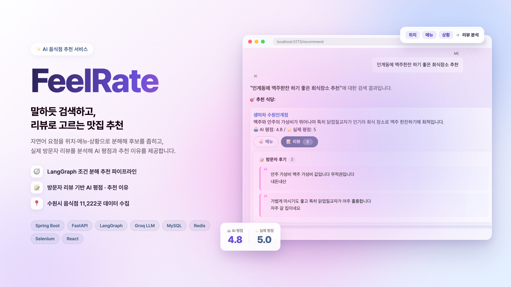
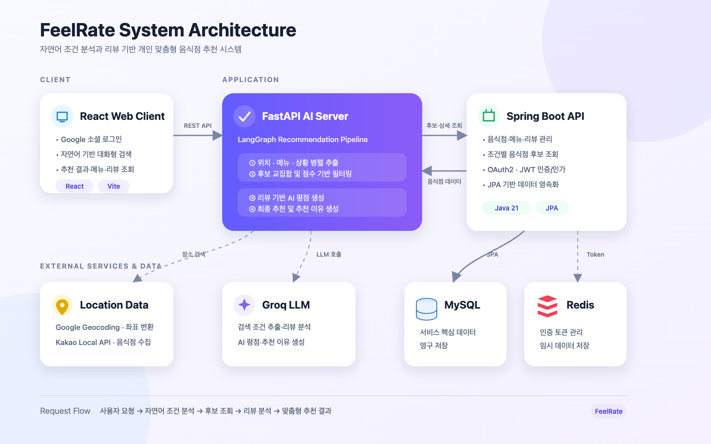
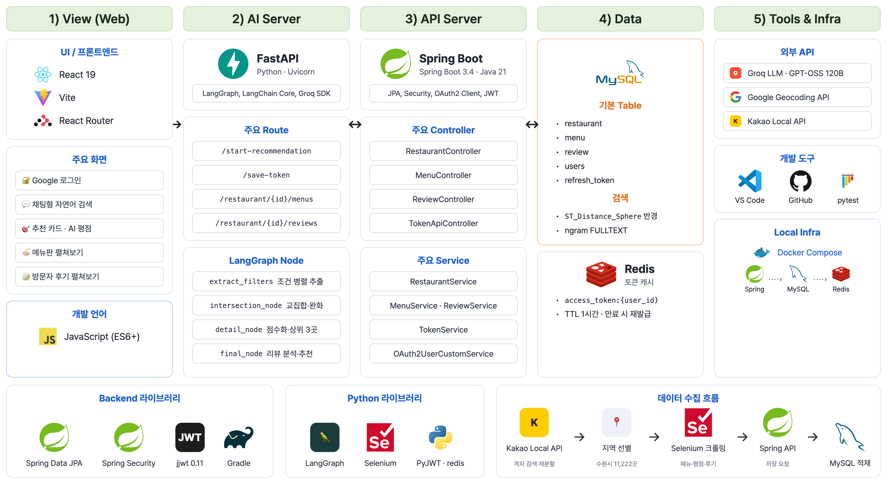
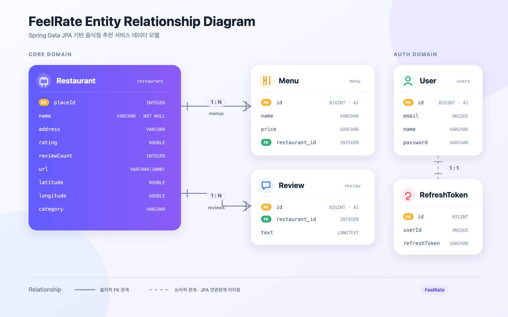

# FeelRate



> 자연어 조건 분석과 리뷰 기반 AI 평점으로 상황에 맞는 음식점을 추천하는 서비스

"수원시청역 근처에서 조용하게 데이트하기 좋은 고깃집"처럼 문장으로 요청하면, LLM이 **위치·메뉴·상황** 조건을 분해해 추출하고 조건마다 알맞은 방식으로 후보 식당을 좁힌 뒤, 실제 방문자 리뷰를 분석해 **AI 평점과 추천 이유**를 제공합니다.

## 아키텍처



## 주요 기능

- **Google 소셜 로그인** — Spring Security OAuth2 + JWT
- **자연어 대화형 검색** — 한 문장으로 위치, 메뉴, 상황·분위기를 함께 입력
- **AI 평점과 추천 이유** — 후보 식당의 방문자 리뷰를 LLM이 분석해 카카오맵 평점과 함께 표시
- **메뉴·리뷰 상세 조회** — 추천 카드에서 메뉴판과 방문자 후기를 펼쳐 확인

## 기술 스택

### Backend


### AI Server


### Frontend


### Database & Infrastructure


### Data Collection & Test


### External Services

- Google OAuth 2.0
- Groq API (LLM)
- Google Geocoding API
- Kakao Local API

## Layered Architecture



## ERD



## 추천 파이프라인

LangGraph 상태 그래프로 흐름을 고정해, 같은 입력은 항상 같은 순서로 실행됩니다.

```
사용자 문장
  └─ ① 조건 추출 (LLM, 병렬)  위치 · 메뉴 · 상황 키워드
       ├─ 위치 후보 없음 → 종료: "장소명과 함께 다시 입력"
       └─ ② 조건별 후보 조회 (Spring API)
            위치: Geocoding → ST_Distance_Sphere 반경 500m
            메뉴: 메뉴명 + 카테고리 일치
            상황: 리뷰 FULLTEXT (ngram)
          ③ 교집합 + 단계적 완화   위치∩메뉴∩상황 → 위치∩메뉴 → 위치∩상황 → 위치
          ④ 점수화 → 상위 3곳      0.6 × 평점 + 0.4 × log(리뷰 수 + 1)
          ⑤ 리뷰 분석 (LLM, 병렬)  AI 평점 · 추천 이유
          ⑥ 최종 추천 (LLM)
```

### 설계 결정: RAG·Tool Calling 에이전트 대신 조건 분해 + 고정 파이프라인

초기에는 리뷰를 임베딩해 질문과 벡터 유사도로 식당을 찾는 RAG 방식과, 조건 조합별 Tool을 LLM 에이전트가 골라 호출하는 방식을 시도했습니다. 하지만 위치(좌표)·메뉴(일치)·분위기(의미)처럼 성격이 다른 조건이 하나의 유사도 점수로 뭉개지고, 에이전트의 Tool 선택이 흔들려 결과를 예측하기 어려웠습니다.

그래서 LLM은 **조건 추출과 리뷰 분석**만 맡고, 각 조건은 성격에 맞는 검색 방식으로 처리하도록 구조를 바꿨습니다. 의미가 비슷한 다른 표현("조용한"/"잔잔한")에는 약해지지만, 추천 서비스에서 더 중요한 위치·메뉴 정확도와 예측 가능성을 우선했습니다.

## 데이터 수집

목록 수집과 상세 크롤링을 두 단계로 나눴습니다.

1. **목록 수집** (`data/collect_restaurants.py`) — Kakao Local API는 한 번에 최대 45건만 반환하므로, 범위를 약 500m 격자로 나눠 검색하고 결과가 45건으로 가득 찬 구역은 4등분·반경 절반으로 다시 검색합니다(최소 100m). 수원시 기준 13,590곳을 수집해 주소로 11,222곳을 선별했습니다.
2. **상세 크롤링** (`data/save_data.py`) — Selenium으로 카카오맵 상세 페이지의 메뉴·평점·방문자 후기를 읽어 Spring API로 저장합니다. 평점과 후기 요소는 주변 랭킹·블로그 영역에도 같은 클래스로 존재하므로 후기 섹션으로 범위를 한정했습니다.

> 수집한 원본 데이터는 저장소에 포함하지 않습니다. 아래 실행 방법으로 직접 수집해야 합니다.

## 실행 방법

### 요구 사항

- Java 21, Python 3.11 이상, Node.js 20 이상, Docker, Chrome (크롤링용)
- API 키: Google OAuth 2.0 클라이언트, Google Maps (Geocoding API), Groq, Kakao REST API

### 1. 설정 파일

각 예시 파일을 복사해 값을 채웁니다. `JWT_SECRET`은 Spring과 Python에 **같은 값**을 넣어야 합니다.

```bash
cp .env.example .env
cp backend/src/main/resources/application-local.properties.example backend/src/main/resources/application-local.properties
cp phyton/app/.env.example phyton/app/.env
```

Google OAuth 클라이언트의 승인된 리디렉션 URI에는 `http://localhost:8080/login/oauth2/code/google`을 등록합니다.

### 2. MySQL · Redis

```bash
docker compose up -d
```

### 3. Spring Boot (8080)

```bash
cd backend
./gradlew bootRun
```

첫 실행 시 JPA가 테이블을 생성합니다. 이후 한국어 부분 일치 검색을 위해 리뷰 FULLTEXT 인덱스를 한 번 추가합니다.

```sql
ALTER TABLE review ADD FULLTEXT INDEX idx_review_text (text) WITH PARSER ngram;
```

### 4. FastAPI AI 서버 (8000)

```bash
cd phyton/app
python -m venv .venv
.venv/bin/pip install -r requirements.txt
.venv/bin/python -m uvicorn main:app --port 8000
```

### 5. 데이터 수집

크롤러의 저장 API는 인증 없이 호출하므로, 수집하는 동안 `application-local.properties`의 `CRAWLER_PUBLIC=true`로 Spring을 실행합니다.

```bash
cd phyton/app
# ① 목록 수집 (수원시 범위: 남,서,북,동)
.venv/bin/python data/collect_restaurants.py --bounds 37.22,126.93,37.33,127.08 --output data/raw/restaurants_suwon.jsonl
# ② 주소로 지역 선별 (예: 수원시 → 인계동)
.venv/bin/python data/filter_restaurants.py 수원시 --input data/raw/restaurants_suwon.jsonl
.venv/bin/python data/filter_restaurants.py 인계동 --input data/filtered/restaurants_수원시.jsonl
# ③ 메뉴·평점·후기 크롤링 → DB 저장
.venv/bin/python data/save_data.py --input data/filtered/restaurants_인계동.jsonl --workers 2
```

### 6. Frontend (5173)

```bash
cd frontend
npm install
npm run dev
```

http://localhost:5173 에서 Google로 로그인한 뒤 검색합니다.

## 테스트

```bash
cd phyton/app
.venv/bin/pip install -r requirements-dev.txt
.venv/bin/python -m pytest
```

LLM 클라이언트 설정, 에러 응답 매핑, 수집기의 격자·재분할·중복 제거, 크롤러 파서(실제 Headless Chrome으로 카카오맵 구조를 재현한 HTML 검증), 프롬프트, JWT 검증을 다룹니다. `KAKAO_API_KEY`가 있으면 실제 Kakao API E2E 테스트도 함께 실행됩니다.

## 프로젝트 구조

```
feelrate/
├── backend/              Spring Boot API (인증, 음식점·메뉴·리뷰, 조건별 후보 조회)
├── phyton/app/           FastAPI AI 서버
│   ├── agent/            LangGraph 추천 파이프라인
│   ├── tools/            조건 추출 · 교집합 · 최종 추천 단계
│   ├── llm/              Groq LLM 클라이언트, 리뷰 분석 호출
│   ├── service/          프롬프트, 조건 추출, 점수화
│   ├── data/             목록 수집 · 지역 선별 · 크롤러
│   └── tests/
├── frontend/             React 채팅형 추천 화면
├── docs/                 아키텍처 · ERD
└── compose.yaml          MySQL · Redis
```

## 팀

2인 팀 프로젝트 (2025.04 ~ 2025.07)

- **김찬호** — 서비스 기획, DB 설계, Spring Boot API·인증, FastAPI AI 서버와 추천 파이프라인, 데이터 수집, React 채팅 UI
- **손민성** — 프론트엔드 UI 수정, 서버 배포
